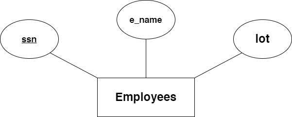
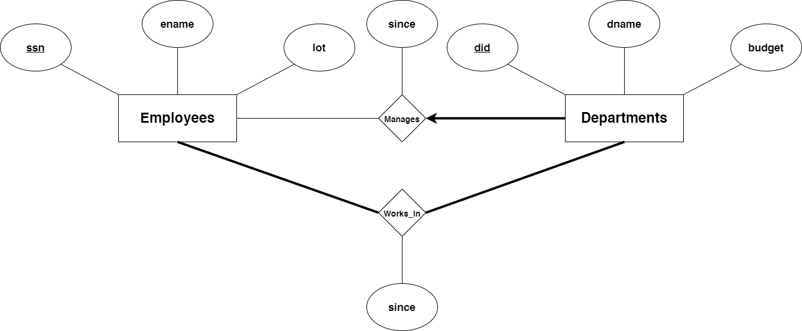

# 
 Relation Models compound

## 
 ER to Relational esempi **vitali** 

# **INDEX**
1. [Entity Set](#entity-set)
2. [Relationship Set](#relationship-set)
3. [Self-Relationship](#self-relationship)
4. [Zero or One Constraint](#zero-or-one-constraint)
5. [One or More | Only One](#one-or-more--only-one)

#

## **Entity Set**

    

Banalmente una struttura standard di un **entity set**, di cui andiamo a definire parametri, chiave primaria e simili

~~~ sql
CREATE TABLE Employees
(
    ssn CHAR(11),           --crea un campo
    e_name VARCHAR(20),     
    /*VARCHAR pone un limite massimo al numero di "caratteri", CHAR ne indica il 
    numero preciso*/
    lot INTEGER,
    PRIMARY KEY(ssn)        --banalmente la chiave primaria
);
~~~

## **Relationship Set**

    

Relazione molti a molti con attributo nel **relationship set**

~~~ sql
CREATE TABLE Employees
(
    ssn CHAR(11),
    ename VARCHAR(20),
    lot INTEGER,
    PRIMARY KEY(ssn)
);

CREATE TABLE Departments
(
    did INTEGER,
    dname VARCHAR(20), 
    budget INTEGER,
    PRIMARY KEY(did)
);

CREATE TABLE WorksIn
(
    ssn CHAR(11),
    did INTEGER,
    since DATE, -- banalissimo attributo della relazione
    PRIMARY KEY(ssn, did),
    FOREIGN KEY(ssn) /*alienizza la chiave primaria, esplicita che il set non ne 
                     possiede di proprie e serve a relazionare due set esterni*/
        REFERENCES Employees, -- specifica il set esterno sopracitato
    FOREIGN KEY(did)
        REFERENCES Departments
);
~~~

## **Self-Relationship**

    

Di facile intesa, molto straightforward

~~~ sql
CREATE TABLE Employees
(
    ssn CHAR(11),
    e_name VARCHAR(20),
    lot INTEGER,
    PRIMARY KEY(ssn)
);

CREATE TABLE Reports_To
(
    subordinate_ssn CHAR(11),
    supervisor_ssn CHAR(11),  /*crei due ssn e li tratti come se appartenessero
                              a due set distinti*/
    PRIMARY KEY(subordinate_ssn, supervisor_ssn), 
    FOREIGN KEY(subordinate_ssn)
        REFERENCES Employees(ssn),
    FOREIGN KEY(supervisor_ssn)
        REFERENCES Employees(ssn) -- facile intesa
);
~~~

## **Zero or One Constraint**

    

Ora si inizia a piangere, versione 1 è valida ma poco efficiente, ora vediamo perchè

~~~ sql
CREATE TABLE Employees
(
    ssn CHAR(11),
    ename VARCHAR(20),
    lot INTEGER,
    PRIMARY KEY(ssn)
);

CREATE TABLE Departments
(
    did INTEGER,
    dname VARCHAR(20),
    budget INTEGER.
    PRIMARY KEY(did)
);

CREATE TABLE Manages
(
    ssn CHAR(11),
    did INTEGER,
    since DATE, 
    PRIMARY KEY (did), -- funziona ma semi illegale e deprecated
    FOREIGN KEY (ssn) REFERENCES Employees,
    FOREIGN KEY (did) REFERENCES Departments
);
~~~

In sostanza lo cestiniamo perchè richiede la creazione di una tabella in più che non è necessaria ed è malleabile semplicemnte attraverso le due tabelle già presenti. Ora vediamo la versione 2, più efficace ed efficiente:
~~~ sql
CREATE TABLE Employees
(
    ssn CHAR(11),
    ename VARCHAR(20),
    lot INTEGER,
    PRIMARY KEY(ssn)
);
CREATE TABLE Dept_Mgr
(
    did INTEGER,
    dname VARCHAR(20),
    budget INTEGER,
    ssn CHAR(11),
    since DATE,
    PRIMARY KEY(did),
    FOREIGN KEY(ssn)
        REFERENCES Employees
);
~~~
Una breve precisazione, la tabella Dept_Mgr creata cattura informazioni in merito ad **entrambe le tabelle** viste precedentemente, ovvero Employees e Department, e tale approccio toglie la necessità di eseguire delle query per poter combinare le due informazioni. Esso però ha un lieve svantaggio rispetto al primo, poichè se molti dipartimenti non dispongono di un manager essi devono essere comunque inizializzati con valori per *ssn* **null**, il che non causava un problema precedentemente. Però preferiamo comunque il secondo metodo poichè l'uso delle query per combinare le informazioni costituiscono un processo **lungo e lento**.

## **One or More | Only One**

    

